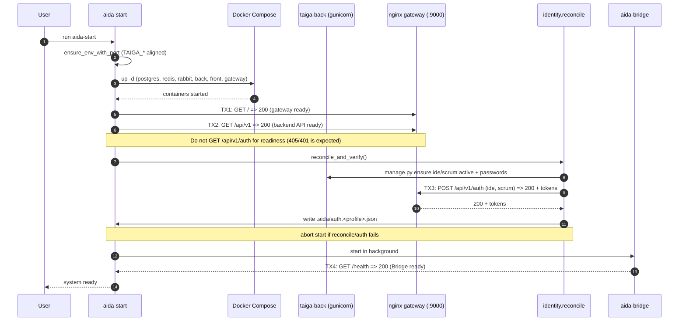

```mermaid
sequenceDiagram
    autonumber
    participant User as User
    participant Start as aida-start
    participant Compose as Docker Compose
    participant Back as taiga-back (gunicorn)
    participant Gwy as nginx gateway (:9000)
    participant Reconcile as identity.reconcile
    participant Bridge as aida-bridge

    User->>Start: run aida-start
    Start->>Start: ensure_env_with_port (TAIGA_* aligned)
    Start->>Compose: up -d (postgres, redis, rabbit, back, front, gateway)
    Compose-->>Start: containers started
    Start->>Gwy: TX1: GET /  => 200 (gateway ready)
    Start->>Gwy: TX2: GET /api/v1  => 200 (backend API ready)
    Note over Start,Gwy: Do not GET /api/v1/auth for readiness (405/401 is expected)

    Start->>Reconcile: reconcile_and_verify()
    Reconcile->>Back: manage.py ensure ide/scrum active + passwords
    Reconcile->>Gwy: TX3: POST /api/v1/auth (ide, scrum) => 200 + tokens
    Gwy-->>Reconcile: 200 + tokens
    Reconcile->>Start: write .aida/auth.<profile>.json
    Note over Start,Reconcile: abort start if reconcile/auth fails

    Start->>Bridge: start in background
    Bridge-->>Start: TX4: GET /health  => 200 (Bridge ready)
    Start-->>User: system ready
```